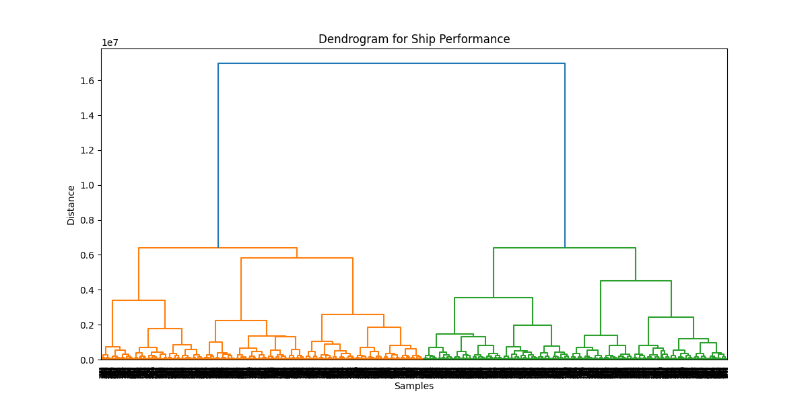

# Ship Performance Clustering using Hierarchical Clustering

## 1. Project Overview
This project focuses on **clustering ship performance data** to group ships based on their operational and technical characteristics.  
I used **Hierarchical Clustering**, a tree-based clustering method, to identify natural groupings in the dataset.  

- **Clustering method used:** Agglomerative Hierarchical Clustering  
- **Linkage methods tested:** Average, Complete, Single, Ward  
- **Distance metrics used:** Euclidean (default), Manhattan (tested but not better), Cosine (tested but not better)  

---

## 2. Dataset Details
- **Source:** Ship performance dataset (real-world operational data)  
- **Number of rows:** 2736 ships  
- **Number of columns:** 30 features  

### Features in Dataset:
1. **Numeric Features:**  
   - Speed_Over_Ground_knots  
   - Engine_Power_kW  
   - Distance_Traveled_nm  
   - Draft_meters  
   - Date [Removed]

2. **Categorical Features:**  
   - Ship_Type (Coastal, Container Ship, Fish Carrier, Tanker, etc.)  
   - Route_Type (Heavy Fuel Oil, Long-haul, Short-haul, Transoceanic)  
   - Engine_Type (Good, Steam Turbine, etc.)  
   - Maintenance_Status (Critical, Fair, Good)  
   - Weather_Condition (Calm, Moderate, Rough)  

---

## 3. Preprocessing
- Checked for **NaNs and infinite values**, replaced with 0.  
- **Encoding:**  
  - **Label Encoding** for high-cardinality feature (`Draft_meters`)  
  - **One-Hot Encoding (OHE)** for remaining categorical features.  
- **Scaling:** All numeric features were standardized to have mean=0 and variance=1 for distance-based clustering.  
- **Final preprocessed dataset:** Numeric + encoded features ready for clustering.  

---

## 4. Finding Optimal Number of Clusters
- Plotted a **Dendrogram** using hierarchical clustering to visually determine the optimal number of clusters.  
- Observed vertical gaps in dendrogram → suggested **2 clusters** as optimal.  
- Elbow method on dendrogram helped confirm the cluster count.  
- 
---

## 5. Clustering Training
- **Algorithm:** Agglomerative Hierarchical Clustering  
- **Number of clusters:** 2 (based on dendrogram analysis)  
- **Linkage methods tested:**  
  - **Average linkage:** Silhouette Score = 0.461 (Best)  
  - Complete linkage: Silhouette Score = 0.445  
  - Single linkage: Silhouette Score = 0.390  
  - Ward linkage: Silhouette Score = 0.451  
- **Distance metrics tried:** Euclidean (default), Manhattan, Cosine → Euclidean gave best results.  

**Notes:**  
- Boolean features were converted to numeric (0/1).  
- Silhouette score used to evaluate cluster cohesion and separation.  
- 2 clusters provided the best balance between **interpretability and cluster quality**.  

---

## 6. Results
- **Cluster 0 & Cluster 1:**  
  - Each cluster groups ships with similar operational and technical features.  
  - Can be used for:  
    - Fleet performance analysis  
    - Maintenance scheduling  
    - Route and operational optimization  

- **Insights:**  
  - Average linkage captures the **overall similarity across ships** better than single or complete linkage.  
  - Silhouette score indicates **moderate to strong separation** between clusters (0.461).  

